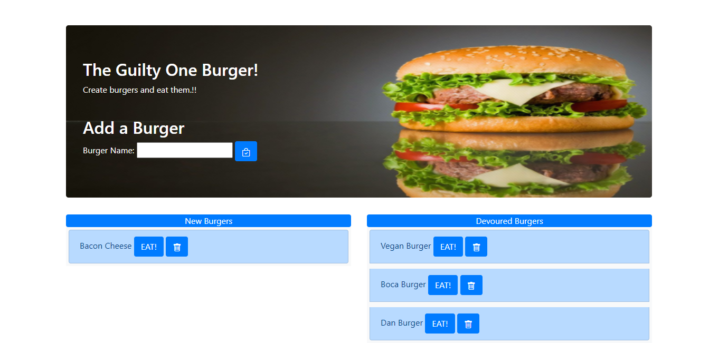

# Employee Tracker

## Task

Create a burger logger with MySQL, Node, Express, Handlebars and a homemade ORM (yum!). Be sure to follow the MVC design pattern; use Node and MySQL to query and route data in your app, and Handlebars to generate your HTML.

The application will be invoked by using the following command:

```
npm start || node app.js
```
  ## Table of Contents

  1. [User Story](#user-story)
  2. [Built With](#built-with)
  3. [How to Install](#how-to-install)
  4. [How to Use](#how-to-use)
  5. [Submission](#submission)
  6. [Index Example](#index-example)
  7. [Questions](#questions)

## User Story

```
Eat-Da-Burger! is a restaurant app that lets users input the names of burgers they'd like to eat.
```
### Built With
----
```
  * Node.js
  * Javascript
  * Heroku
  * Node Modules
    - mysql (database manipulation)
    - express
    - express-handlebars
```    
### How to Install
----
```
npm i
```

### How to Use
----
```
  1- Enter the website https://burger-logger3.herokuapp.com/.
  2- Add a burger of your choice
  3- Its going to be added in the new burgers side.
  4- You can click the eat button and its going to be move to the side Burgers eated.
  5- You can delete any burger anytime.
```    
### Submission
---

Github Repo URL: 
[https://github.com/v1zconde/burger_logger](https://github.com/v1zconde/burger_logger)

Heroku Deployed URL: 
[https://burger-logger3.herokuapp.com/](https://burger-logger3.herokuapp.com/)

---
### Index Example



  ## Questions
you have any questions about the repo, open an issue or contact me directly at rvasquez1@gmail.com. You can find more of my work at 
  Github: [v1zconde](http://github.com/v1zconde)

